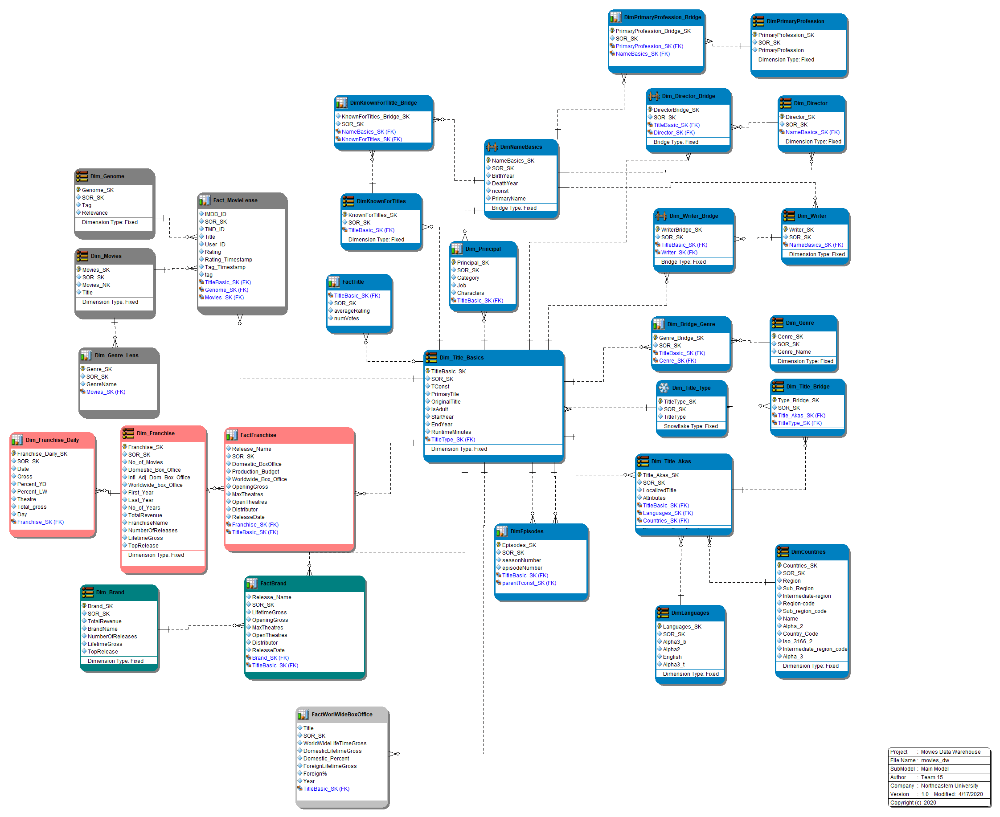

# Data Warehouse and Business Intelligence for IMDB Data

## Installation

You need the below set of tools and Databases to run the Project  
1 - Talend Real-Time Data Platform 7.1   
2 - Mircrosoft SQL Server  
3 - Microsoft SQL server Management Studio  
4 - Mirosoft PowerBI  
5 - Tableau 

### Using the Project

1 -  Run the DDL "DDL for IMDb Project Dimensional Model.sql" present in SQL folder in Microsoft SQL Server   
2 - In Talend, make the input connections necessary  
3 - Run the Final Job in Talend

## Sample Talend Jobs and ER Model

## Sample PoweBI Visualizations
